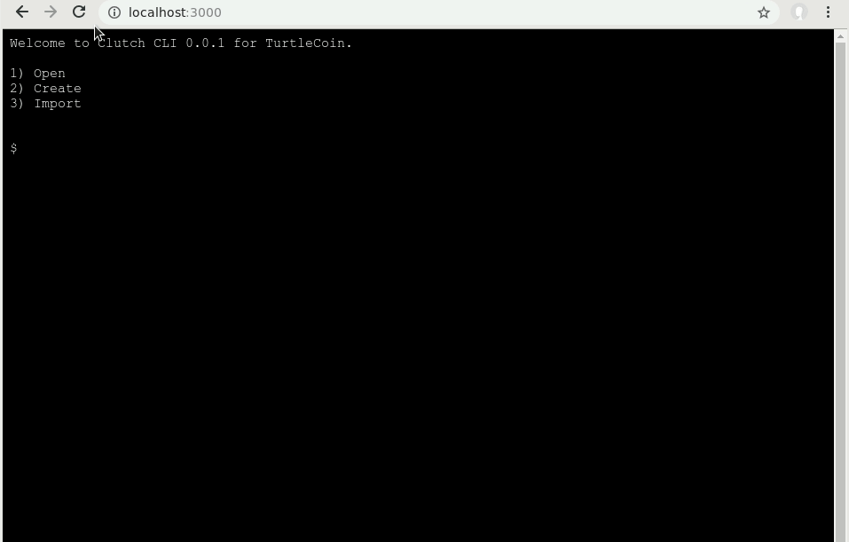

# Clutch

Clutch is a browser based CLI wallet for TurtleCoin utilzing [xterm.js](https://github.com/xtermjs/xterm.js) and [turtlecoin-wallet-backend-js](https://github.com/turtlecoin/turtlecoin-wallet-backend-js).



## Disclaimer

This project is still in its early stages, with little to no functionality.

Currently commands are passed to server-side for processing, and thus wallets are stored and processed in a centralized manner. This can be useful for services that wish to integrate a wallet CLI in their tools and apps. The goal is to have a client-side only version too, however, currently this is not fully supported yet by [turtlecoin-wallet-backend-js](https://github.com/turtlecoin/turtlecoin-wallet-backend-js).

## Getting Started

```
# clone
git clone https://github.com/TurtleCoin/turtlecoin-cli-web-wallet

# change working directory
cd turtlecoin-cli-web-wallet

# install dependencies
npm i

# start
npm start


```
